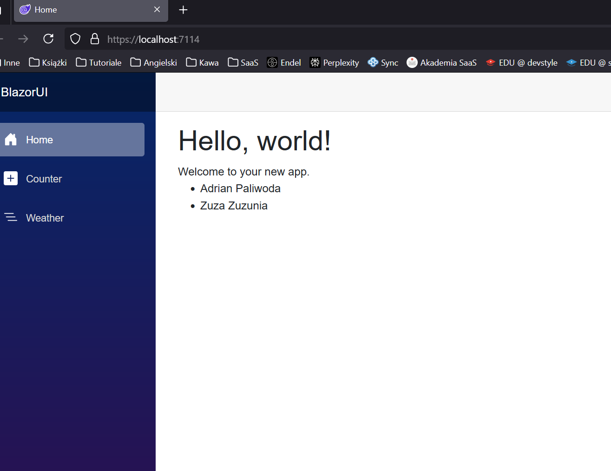
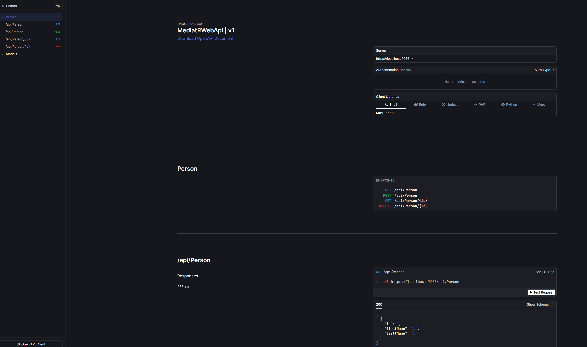

# Genesis
The code is based on "Intro to MediatR - Implementing CQRS and Mediator Patterns" course

[About course](https://www.youtube.com/watch?v=yozD5Tnd8nw)

# Technologi used
- .NET 9
- CQRS
- Mediator Patterns

# Example

## Blazor View

## Scalar

